# こんにちは、Julian です 👋

**ブラジル・サンパウロ出身 ／ コンピュータサイエンス専攻 ／ 日本のIT企業でのキャリアを目指しています** 🇧🇷 → 🇯🇵

Javaを軸にバックエンドを学びながら、生成AIや機械学習を取り入れたアプリケーションの開発に取り組んでいます。
目標は、日本企業が求める技術領域に合わせて専門性を磨き、チームに貢献できるエンジニアになることです。

---

## 🎯 いま取り組んでいること

- ☕ **Java** によるバックエンド開発（オブジェクト指向・データベース設計）
- 🤖 **生成AI API** を組み込んだアプリの設計と実装
- 🎨 Figma を使った画面設計（UI/UX）
- 🔐 クラウドとサイバーセキュリティを学習中

---

## 🛠 Tech Stack

| 分野 | 内容 |
| --- | --- |
| Backend | Java, Python, Node.js, MySQL, Firebase, Database Design, SDLC |
| AI | Gemini API, Machine Learning, GAN, 画像認識API, Prompt Engineering |
| Frontend / Design | HTML/CSS, JavaScript, Figma, Photoshop |
| Environment | Linux |
| 学習中 | Cloud, Cybersecurity, AI Analytics |

---

## 📦 Projects

| プロジェクト | 解決したい課題 | アプローチ | 使用技術 |
| --- | --- | --- | --- |
| **BemAqui** | 気持ちが落ち着かないとき、いつでも使える感情サポートを届ける | マインドフルネスの手法とAIチャットを組み合わせた感情支援アプリ | Gemini API, Firebase, Python |
| **Portal Crivo** | ディープフェイクやAI生成画像を、誰でもアップロードだけで確認できるようにする | 実画像とAI生成画像の2つのデータセットを作成し、学習を重ねて判定を改善 | JavaScript, Node.js, bcrypt, GAN, Machine Learning, 画像認識API |

> この2つは **卒業研究（TCC）として取り組んだ主要プロジェクト** です。公開リポジトリはありませんが、設計や実装について詳しくお話しできます。
> 学業では企業連携の課題など、新しいプロジェクトに継続的に取り組んでおり、**成果が整い次第このページに追加していきます。**

---

## 🌸 なぜ日本なのか

日本で働き、暮らすことは、私の長年の夢です。
その夢を憧れで終わらせず、現実のキャリアにするために、大学の残り約3年間を準備期間と位置づけています。

日本企業が必要とする技術領域を調べ、その分野に合わせて学びを深め、成果をポートフォリオとして形にしていきます。日本語の学習も継続しています。
夢の大きさに見合うだけの努力を、これからも積み重ねていきます。

日本のチーム開発で大切にされている **改善（Kaizen）** と **丁寧なコミュニケーション** を、学生時代から意識して実践しています。

---

## 📈 次の目標

- [ ] Java でバックエンドの小さなサービスを公開する
- [ ] クラウド上にデプロイして、運用まで経験する
- [ ] セキュリティの基礎（認証・脆弱性対策）を実装に取り入れる
- [ ] 日本語の学習を続ける

---

## 📫 Contact

- ✉️ jmoncoski@outlook.com
- 💼 [LinkedIn](https://www.linkedin.com/in/julian-moncoski)

**インターンシップ、ジュニア職、ビザサポートのある募集を探しています。お気軽にご連絡ください。**
どうぞよろしくお願いいたします。

---

  

